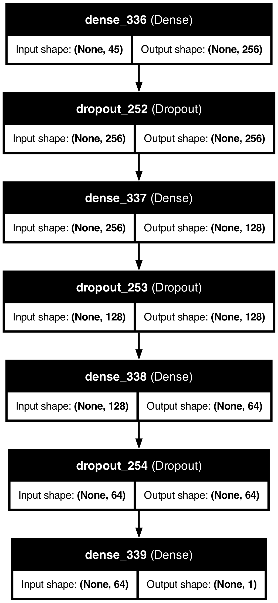

# Higgs Boson Machine Learning Challenge
<p><a href="https://www.kaggle.com/c/higgs-boson">https://www.kaggle.com/c/higgs-boson</a></p>

# Model structure
- `AMS_test.ipynb` : 4 layers densely connected DNN + 3 Dropout

<p align="center">
  
</p>

modelはloss functionを最適化するように設定し、EarlyStoppingでAMSを監視し、最終的にAMSが最大となるepochを採用する。また、このmodelをModelCheckpointでmodel.kerasとして保存。5-fold cross validationを4回行い、アンサンブルをとったものを最終的なモデルとしている。こうすることでtrainingとvalidationデータの分離による誤差を減らしている。
# 感度の指標
- Approximate median significance (AMS)
$$
\mathrm{AMS}=\sqrt{2\left(\left(s+b+b_r\right) \log \left(1+\frac{s}{b+b_r}\right)-s\right)}
$$
ここで、
$$
s=\sum_{i=1}^nw_i1\{y_i=s\}1\{\hat{y}_i=s\}\\
b=\sum_{i=1}^nw_i1\{y_i=b\}1\{\hat{y}_i=s\}\\
$$
- `s` : Scoreでカットした後のsignalのイベント数
- `b` : Scoreでカットした後のBGのイベント数の期待値
- `b_r` : `b`に対する系統効果


### 実装
ams関数でAMSを計算し、best_ams_from_predでAMSを最大化するようなthresholdとそのときのAMSを計算。出力は最適化したAMSとthreshold。
```
def ams(s, b, b_r):
    radicand = 2.0 * ((s + b + b_r) * np.log(1.0 + s / (b + b_r)) - s)
    return np.sqrt(max(radicand, 0.0))

def best_ams_from_pred(pred, y_true, w_true, wFactor, b_r, n_thr):
    best     = -np.inf
    best_thr = None
    for thr in np.linspace(0.0, 1.0, n_thr):
        s = w_true[(pred > thr) & (y_true == 1)].sum()
        b = w_true[(pred > thr) & (y_true == 0)].sum()
        score = ams(s * wFactor, b * wFactor, b_r = b_r)
        if score > best:
            best     = score
            best_thr = float(thr)
    return float(best), float(best_thr)
```


# ファイルの説明
- AMS_test.ipynb  
  training.csvから学習し、test.csvの評価とkaggle提出用のcsvファイルの出力を行う。

- importance.ipynb  
構築したmodelにおける重要な特徴量の上位20個を出力する。training dataの前処理で欠損値フラグは付けていない。

- submission.ipynb  
AMS_test.ipynbで学習済みのモデルをもとにtest.csvの評価のみを行う。test.csvにWeightとLabel columnsがないと評価はしないようにしている。**AMSの評価を行うだけならこれを実行するだけで十分です。**

- best_modle  
AMS_test.ipynbで学習したモデルのデータが入っているディレクトリ。中にはそれぞれのseed, foldにおけるAMSが最大となるモデルの情報がある。また、学習で共通の情報をmeta.jsonに入れている。

- submission  
AMS_test.ipynbで出力したkaggle提出用のcsvファイルが入っている。

- report.pdf  
モデルのパラメータの値などを書いているレポート